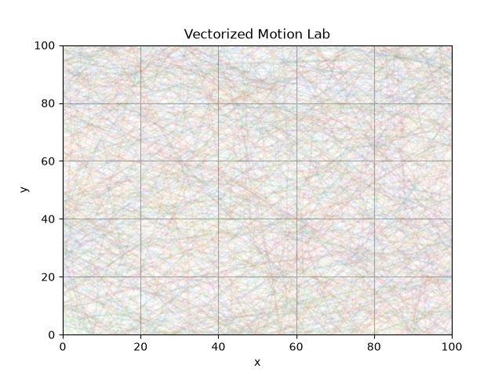

# Vectorized Motion Lab

A vectorized particle universe built with NumPy and Matplotlib.

## Overview

Vectorized Motion Lab simulates particles evolving inside a bounded environment under stochastic perturbations. The system records the complete history of particle motion and provides both trajectory visualizations and real-time animations.

## Features

- Vectorized particle updates using NumPy
- Random perturbations (Brownian-like motion)
- Boundary collisions
- Full state history recording
- Static trajectory visualization
- Real-time particle animation
- Modular code organization

## Tech Stack

- Python
- NumPy
- Matplotlib

## Project Structure


## Project Structure

```text
vectorized-motion-lab/

├── images/
│     ├── trajectory.png
│     └── animation.gif
│
├── src/
│     ├── initialize.py
│     ├── simulation.py
│     └── visualization.py
│
├── main.py
├── requirements.txt
└── README.md
```


## Trajectory Visualization



## Animation


## Concepts Demonstrated

- State representation
- Time evolution
- Vectorized computation
- Stochastic dynamics
- Boundary constraints
- History recording
- Data visualization
- Modular code design
